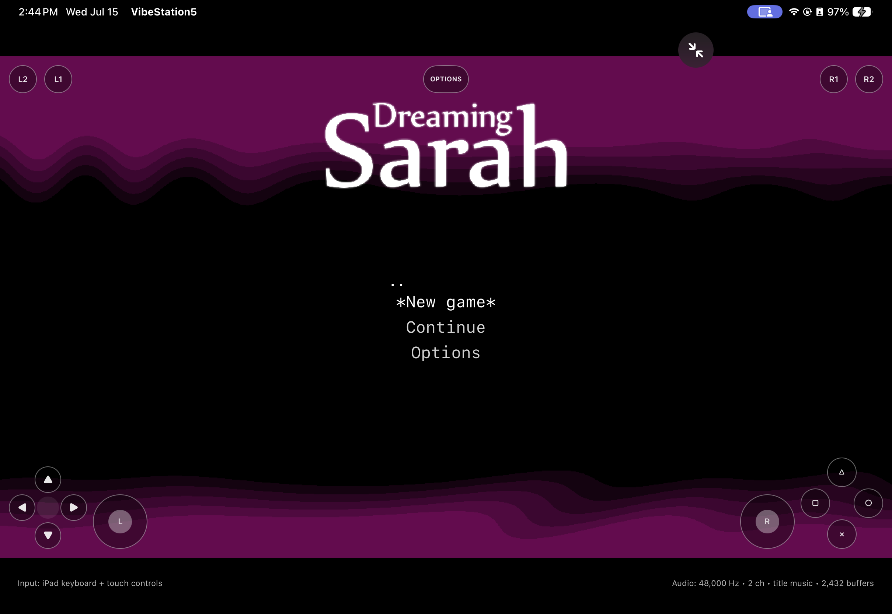
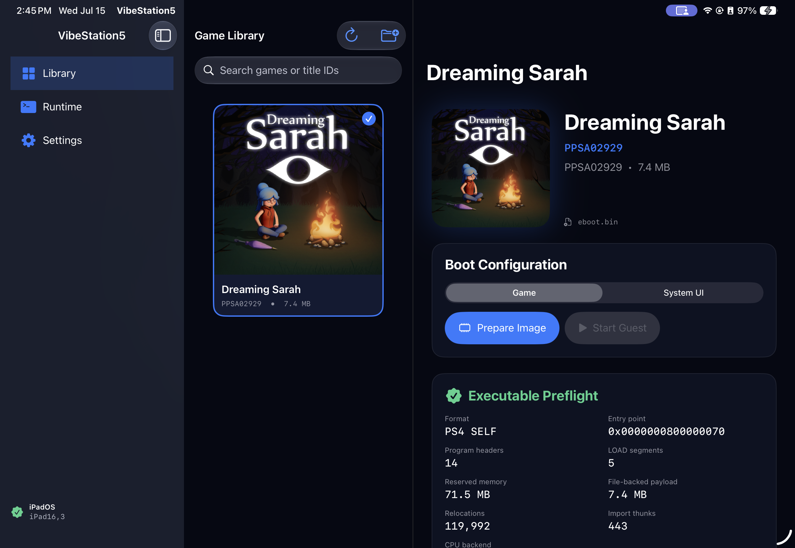
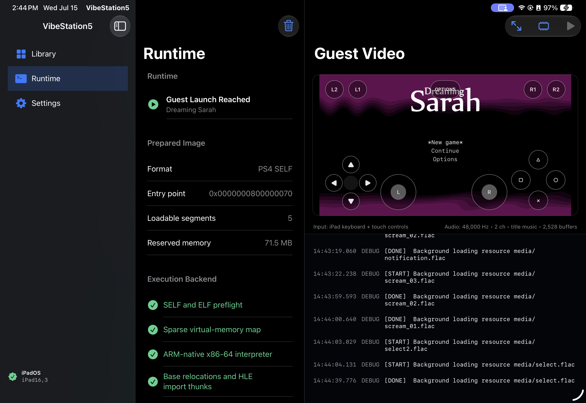
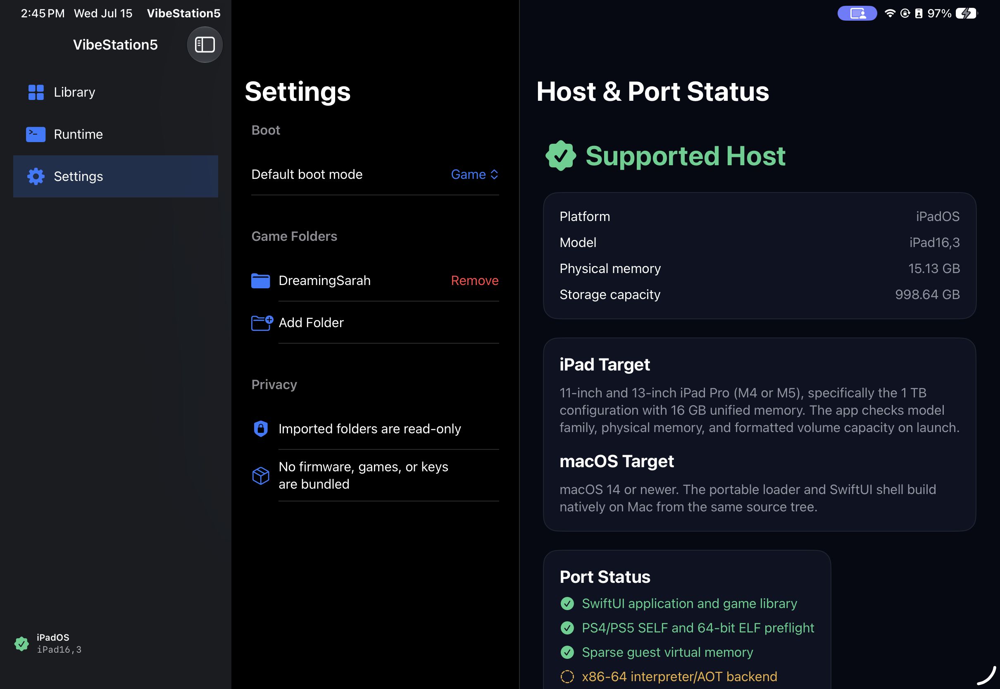
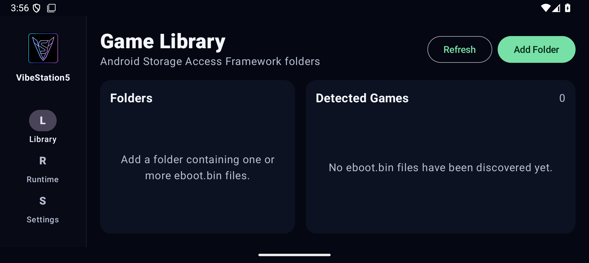
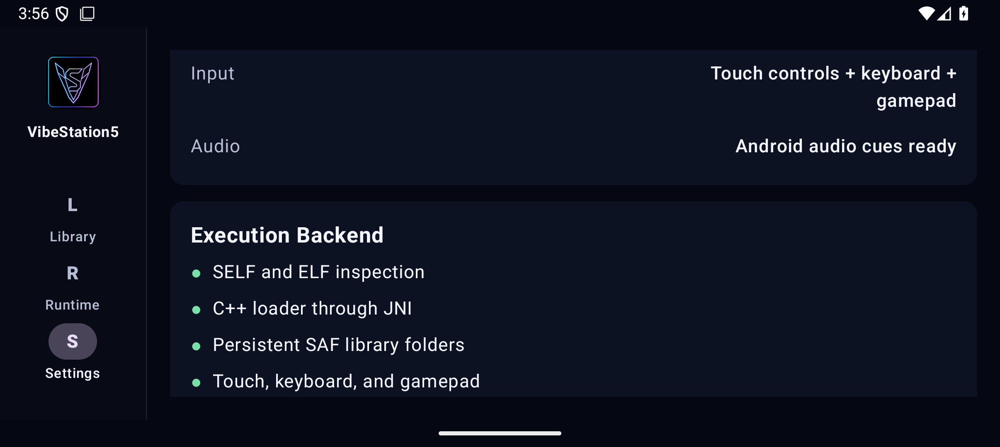
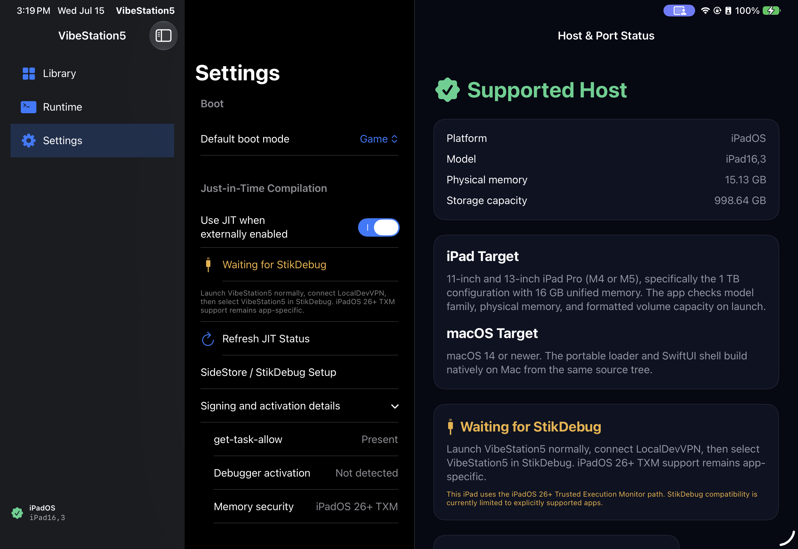

# VibeStation5

<p align="center">
  
</p>

VibeStation5 is an experimental PS4/PS5 runtime with native macOS, iPadOS, and Android targets. The Apple app uses SwiftUI; the Android app uses Kotlin, Jetpack Compose, and a C++ loader reached through JNI. It is **inspired by and derived from [SharpEmu](https://github.com/sharpemu/sharpemu)**, whose loader, runtime, and emulation research provided the foundation for this port.

The Apple-platform work replaces SharpEmu's desktop-oriented x86-64 direct-execution path with an ARM64-native interpreter designed to operate within iPadOS executable-memory restrictions, plus an optional SideStore/StikDebug JIT activation and executable-memory path.

The Android target currently provides the native application shell, persistent game-library access, PS4/PS5 executable preflight, JNI/C++ host probing, touch/keyboard/gamepad input, audio cues, and a full-screen compatibility preview. The x86-64 guest interpreter and GPU backend have not yet been ported to Android, so the Android target does not currently launch guest code.

> [!IMPORTANT]
> VibeStation5 is an early compatibility and CPU bring-up project—not a general-purpose playable PS5 emulator. The Dreaming Sarah screen below is the current interactive title-menu milestone while broader HLE, scheduling, GPU, and Metal rendering work continues.

## Running on iPad

The current build reaches an interactive Dreaming Sarah menu on a physical 11-inch iPad Pro M4, with title music, selection effects, touch controls, iPad keyboard input, DualSense support, and a full-screen guest view.



<table>
  <tr>
    <td width="50%"></td>
    <td width="50%"></td>
  </tr>
  <tr>
    <td align="center"><strong>Game Library</strong></td>
    <td align="center"><strong>Runtime Console</strong></td>
  </tr>
  <tr>
    <td colspan="2"></td>
  </tr>
  <tr>
    <td colspan="2" align="center"><strong>Settings and Host Status</strong></td>
  </tr>
</table>

Dreaming Sarah is used here only as a compatibility-test title. The game, firmware, keys, and complete copyrighted game data are not included in this repository.

## Running on Android

The Android target is a native landscape tablet application with a responsive phone layout. It uses Android's Storage Access Framework for persistent folder access, recursively discovers `eboot.bin`, reads `sce_sys/param.json` metadata and artwork, and inspects decrypted ELF plus recognized PS4/PS5 SELF headers in C++ through JNI.

<table>
  <tr>
    <td width="50%"></td>
    <td width="50%"></td>
  </tr>
  <tr>
    <td align="center"><strong>Android Game Library</strong></td>
    <td align="center"><strong>C++ / JNI Backend Status</strong></td>
  </tr>
</table>

The packaged JNI library supports `arm64-v8a` Android hardware and `x86_64` emulators. Settings report the loaded ABI, memory page size, and an executable-memory transition probe. The runtime screen includes the same full-screen, touch, keyboard, gamepad, and audio validation surfaces as the Apple app, but clearly labels them as a compatibility preview until Android guest execution is connected.

## Current capabilities

- Shared macOS and iPadOS SwiftUI game library, runtime console, settings, and full-screen guest UI
- Native Kotlin/Jetpack Compose Android library, runtime console, settings, and full-screen preview UI
- Security-scoped Apple folder imports and Android Storage Access Framework folders that persist across launches
- Recursive `eboot.bin` discovery with `sce_sys/param.json` metadata and artwork
- PS4/PS5 SELF and decrypted 64-bit ELF inspection
- Lazy file-backed virtual memory with PS4/PS5 image bases
- Dynamic-table parsing, x86-64 base relocations, and HLE import thunks
- Vendored Capstone x86-64 decoding for macOS and iPadOS ARM64
- ARM64-native x86-64 interpreter covering the current integer, atomic, BMI2, SIMD, and AVX bring-up paths
- AVFoundation guest PCM output plus title-music and menu-effect playback for the Dreaming Sarah milestone
- DualSense/PS5 controller, hardware keyboard, and on-screen touch input
- SideStore/StikDebug `get-task-allow` signing, debugger-activation detection, and a `MAP_JIT` executable-memory probe with automatic interpreter fallback
- Game and System UI preflight modes with deterministic runtime reporting
- Unit coverage for executable loading, virtual memory, platform gating, input/audio, and ARM-native guest execution
- Android JVM tests plus an on-device JNI instrumentation test for the native executable inspector and memory probe

The iPad target currently gates execution to 1 TB / 16 GB iPad Pro M4 and M5 configurations. The macOS target requires macOS 14 or newer.

## Build Apple targets

Requirements:

- Xcode with the required Apple platform SDKs
- [XcodeGen](https://github.com/yonaskolb/XcodeGen)

Generate the project and build the iPad simulator target:

```sh
xcodegen generate
xcodebuild -project VibeStation5.xcodeproj \
  -scheme VibeStation5 \
  -sdk iphonesimulator \
  -destination 'platform=iOS Simulator,name=iPad Pro 13-inch (M5)' \
  build
```

Build the macOS target:

```sh
xcodebuild -project VibeStation5.xcodeproj \
  -scheme VibeStation5-macOS \
  -destination 'platform=macOS' \
  build
```

The standalone probe can inspect and exercise a user-supplied `eboot.bin` without the UI:

```sh
xcodebuild -project VibeStation5.xcodeproj \
  -scheme VibeStation5Probe \
  -configuration Release \
  -derivedDataPath /tmp/VibeStation5Probe \
  CODE_SIGNING_ALLOWED=NO build

/tmp/VibeStation5Probe/Build/Products/Release/VibeStation5Probe /path/to/eboot.bin
```

## Build the Android target

Requirements:

- JDK 17 or newer
- Android SDK 35
- Android NDK 27.2.12479018 and CMake 3.22.1; Gradle installs these automatically when the Android SDK licenses have been accepted

Build the debug APK and run the host-side parser tests:

```sh
cd Android
ANDROID_HOME="$HOME/Library/Android/sdk" \
  ./gradlew testDebugUnitTest assembleDebug
```

The APK is written to `Android/app/build/outputs/apk/debug/app-debug.apk`.

With an Android device or emulator connected, run the JNI test on the actual Android runtime:

```sh
cd Android
ANDROID_HOME="$HOME/Library/Android/sdk" \
  ./gradlew connectedDebugAndroidTest
```

## Optional JIT on iPadOS

The iOS build declares `get-task-allow` so SideStore/StikDebug can discover the process and activate JIT by attaching a debugger. VibeStation5 exposes the live entitlement, debugger, TXM, and `MAP_JIT` probe state in Settings. The separate macOS hardened-runtime target carries Apple's `allow-jit` and unsigned-executable-memory entitlements.

See [Enabling JIT with SideStore and StikDebug](docs/JIT.md) for setup steps and the current iPadOS 26/27 limitations. JIT activation prepares executable memory; guest execution still uses the interpreter until the x86-64-to-ARM64 dynamic translator is connected.



## Project status

The Apple loader, runtime shell, decoder, and CPU interpreter run natively on ARM64. Dreaming Sarah reaches the current interactive title-menu milestone on iPad; ASTRO BOT's SELF also loads, applies 557,366 relocations, and executes one million guest instructions in the standalone probe before its configured budget stops the run.

On Android, the Kotlin/Compose application and C++/JNI SELF/ELF inspector are operational on `arm64-v8a` and `x86_64`. Porting the guest memory subsystem, x86-64 interpreter, HLE imports, and video backend from Swift remains the next Android runtime milestone.

Major remaining work includes broader HLE/syscall behavior, thread scheduling, complete x86-64/AVX semantics, firmware services, GNM/GNMX emulation, and a general Metal renderer.

## Attribution and license

VibeStation5 is inspired by and derived from the [SharpEmu project](https://github.com/sharpemu/sharpemu), an experimental PlayStation 5 emulator for Windows, Linux, and macOS. SharpEmu copyright notices and SPDX headers are retained in derived source files.

VibeStation5 is licensed under **GPL-2.0-or-later**. See [LICENSE](LICENSE). The vendored [Capstone](https://www.capstone-engine.org/) sources retain their upstream BSD/LLVM license files under `Vendor/Capstone`.

Dreaming Sarah and its artwork are property of their respective rights holders. Screenshots are included for compatibility documentation and project demonstration only.
